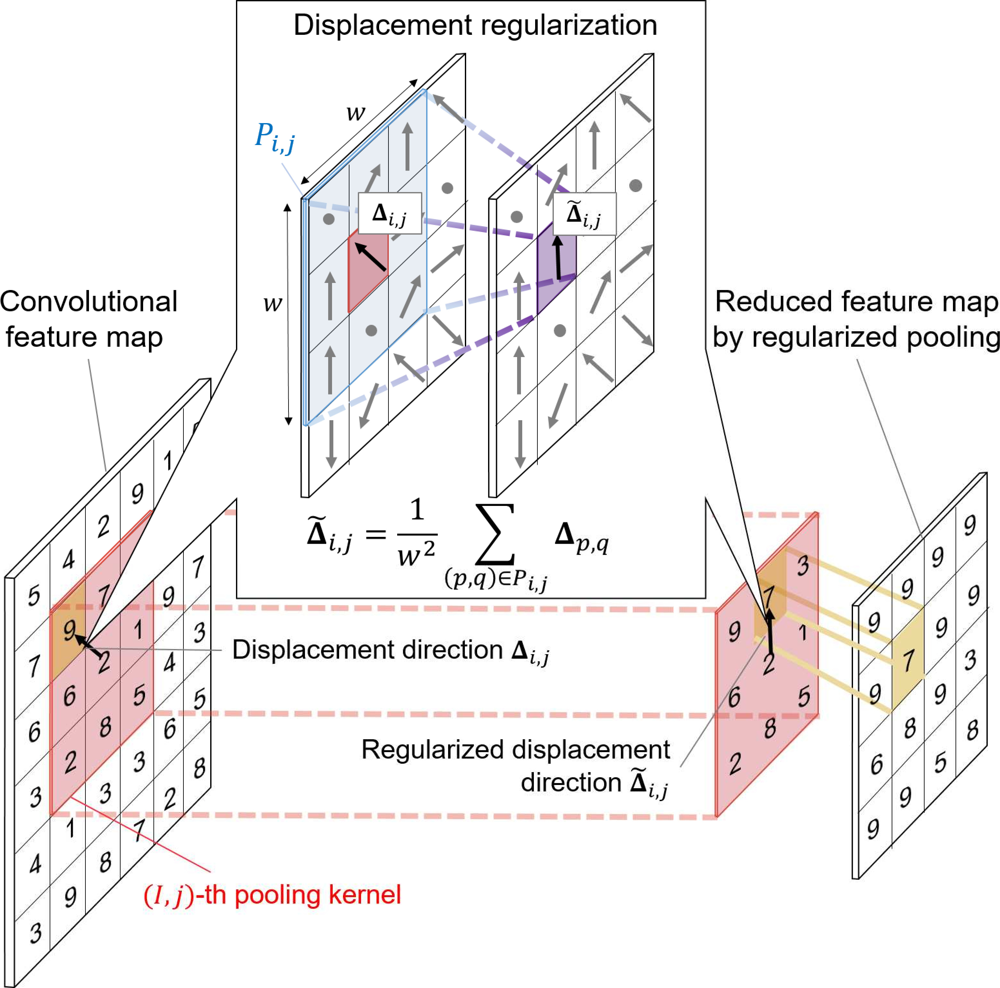

# Regularized-pooling
by Takato Otsuzuki, Hideaki Hayashi, Yuchen Zheng, Seiichi Uchida. 

[[Home]](http://human.ait.kyushu-u.ac.jp/)
[[Paper]](https://arxiv.org/abs/2005.03709)

## Approach

<pre>
 | 
Fig.1 (a) Max pooling and (b) our regularized pooling.      Fig.2  Overview of the regularized pooling operation
</pre>
 Max pooling and (b) our regularized pooling.

)

## Prerequisites
* [python >= 3.7](https://www.python.org/)
* [ubuntu 18.04](https://ubuntu.com/)
* CPU or GPU(NVIDIA Driver >= 430)
